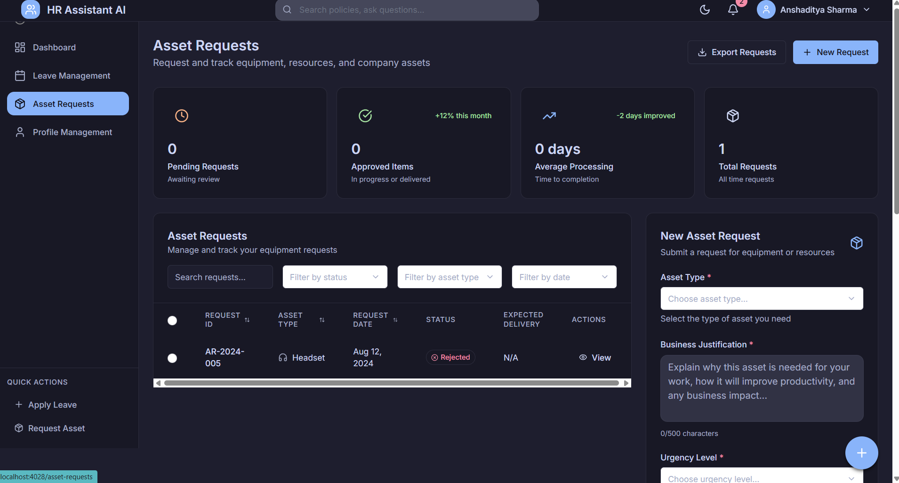
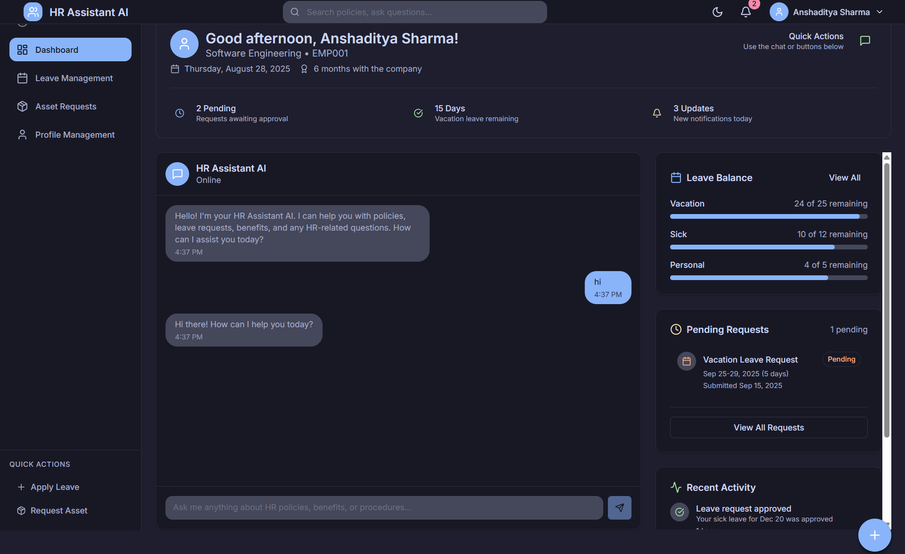
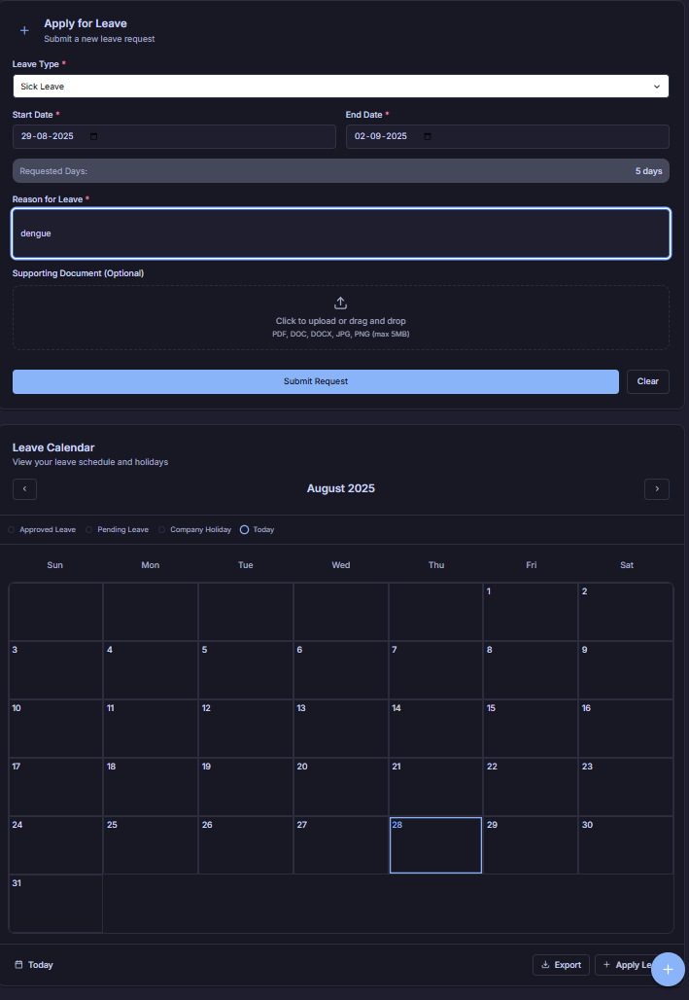
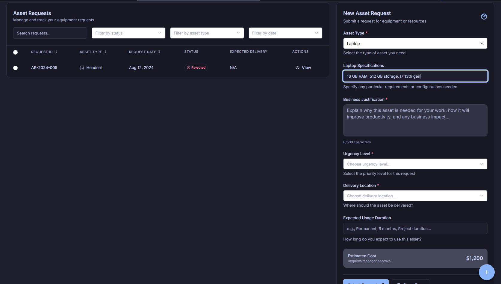
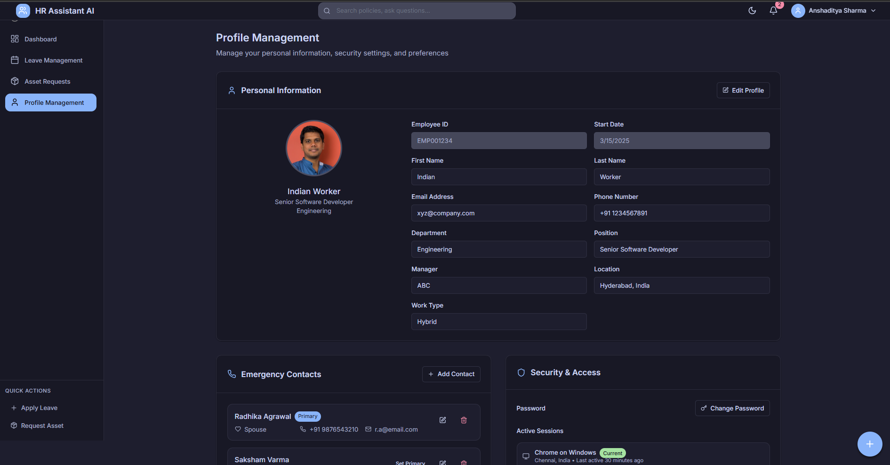

## 📸 Project Preview

<p align="center">
  
</p>

<p align="center">
  
</p>

<p align="center">
  
</p>

<p align="center">
  
</p>

<p align="center">
  
</p>

---

A modern React-based project utilizing the latest frontend technologies and tools for building responsive web applications.

## 🚀 Features

- **React 18** - React version with improved rendering and concurrent features
- **Vite** - Lightning-fast build tool and development server
- **Redux Toolkit** - State management with simplified Redux setup
- **TailwindCSS** - Utility-first CSS framework with extensive customization
- **React Router v6** - Declarative routing for React applications
- **Data Visualization** - Integrated D3.js and Recharts for powerful data visualization
- **Form Management** - React Hook Form for efficient form handling
- **Animation** - Framer Motion for smooth UI animations
- **Testing** - Jest and React Testing Library setup

## 📋 Prerequisites

- Node.js (v14.x or higher)
- npm or yarn

## 🛠️ Installation

1. Install dependencies:
   ```bash
   npm install
   # or
   yarn install
Start the development server:

bash
Copy code
npm start
# or
yarn start
📁 Project Structure
bash
Copy code
react_app/
├── public/             # Static assets
├── src/
│   ├── components/     # Reusable UI components
│   ├── pages/          # Page components
│   ├── styles/         # Global styles and Tailwind configuration
│   ├── App.jsx         # Main application component
│   ├── Routes.jsx      # Application routes
│   └── index.jsx       # Application entry point
├── .env                # Environment variables
├── index.html          # HTML template
├── package.json        # Project dependencies and scripts
├── tailwind.config.js  # Tailwind CSS configuration
└── vite.config.js      # Vite configuration
🧩 Adding Routes
To add new routes to the application, update the Routes.jsx file:

jsx
Copy code
import { useRoutes } from "react-router-dom";
import HomePage from "pages/HomePage";
import AboutPage from "pages/AboutPage";

const ProjectRoutes = () => {
  let element = useRoutes([
    { path: "/", element: <HomePage /> },
    { path: "/about", element: <AboutPage /> },
    // Add more routes as needed
  ]);

  return element;
};
🎨 Styling
This project uses Tailwind CSS for styling. The configuration includes:

Forms plugin for form styling

Typography plugin for text styling

Aspect ratio plugin for responsive elements

Container queries for component-specific responsive design

Fluid typography for responsive text

Animation utilities

📱 Responsive Design
The app is built with responsive design using Tailwind CSS breakpoints.

📦 Deployment
Build the application for production:

bash
Copy code
npm run build